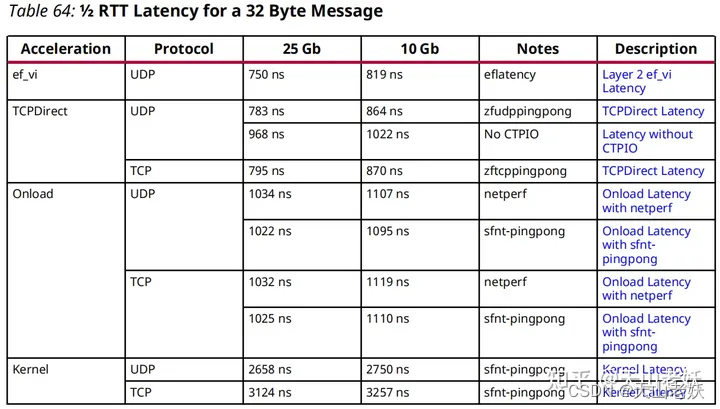

## Onload

Onload 是 Solarflare 的 Kernel Bypass 网络技术方案，由 Onload、TCPDirect、ef_vi 三种使用模式

Onload

- onload 是 Solarflare 最经典的 kernel bypass 网络协议栈，属于透明 kernel bypass，提供了兼容 socket 网络编程的接口，用户不需要修改自己的代码，只需在程序启动前 preload libonload.so 即可使用

TCPDirect

- tcpdirect 基于 ef_vi 实现了上层网络协议栈，提供了类似 socket 的 API：zocket，能让用户读写 tcp/udp 的 payload 数据，同时也继承了 ef_vi zero-copy 的特性。tcpdirect 要求使用 huge pages

ef_vi

- ef_vi 是一个 level 2 的底层 API，可以收发原始 Ethernet 帧，但没有提供上层协议的支持。ef_vi 最大的特点是 zero-copy：要求用户预先分配一些 recv buffer 提供给 ef_vi 使用，网卡收到包后会直接写入 buffer，用户通过 eventq poll 接口获得已填充数据的 buffer id 即可开始处理接收数据，处理完后再把 buffer 交还 ef_vi 循环使用

X2522 低延迟测试 32 字节消息单程延迟如下：

## 参考资料

- <https://quantfabric.blog.csdn.net/article/details/123028251>

- <https://blog.csdn.net/Erice_s/article/details/121686572>