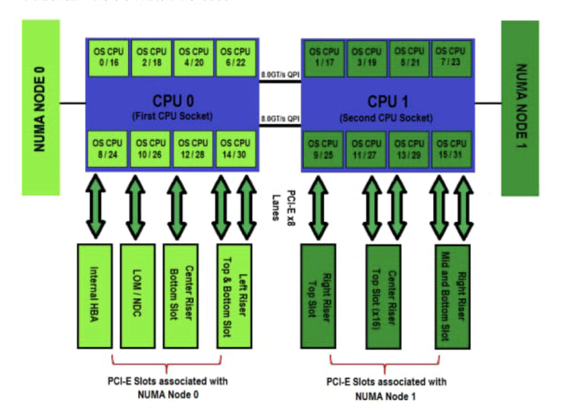

## Solarflare 网卡安装

厂商的 Mac 地址前缀为 `00:0f`，可以根据此来判断哪张网卡为 Solarflare 网卡

### PCIe 插槽

支持 PCIe x8，也向下兼容 PCIe x4，但 x4 的性能会下降

Numa 相关：



由于 PCIe 插槽只对应一个 CPU，因此还要留意此信息，与设置 Onload 有关

如果 socket 线程在 CPU 0 上运行，但通过 CPU 1 的 PCIe 发送数据，那么就会通过 2 个 CPU 之间的  QPI 总线传输，增大传输时延

## 安装 OpenOnload

安装 Onload 会自动升级驱动和固件

软件依赖：

- Kernel-devel

驱动获取地址 OpenOnload

<https://china.xilinx.com/support/download/nic-software-and-drivers.html#open>

- 源码包：<https://china.xilinx.com/content/dam/xilinx/publications/solarflare/onload/openonload/9_0_1_86/SF-109585-LS-46-OpenOnload-Release-Package.zip>
- DKMS：<https://china.xilinx.com/content/dam/xilinx/publications/solarflare/onload/openonload/9_0_1_86/SF-120887-LS-17-OpenOnload-DKMS-Release-Package.zip>

下载后解压源码

```bash
tar zxvf onload-9.0.1.86.tgz -C .
```

进行编译

```bash
cd onload-9.0.1.86/scripts/
sh onload_install

# 初次安装后进行 reload
# 无需多次
onload_tool reload
```

安装使用工具

<https://china.xilinx.com/content/dam/xilinx/publications/solarflare/drivers-software/linux/SF-107601-LS-75-linux-utilities-rpm-64bit.zip>

```bash
dnf localinstall -y sfutils-8.3.3.1000-1.x86_64.rpm
```

### 编译失败处理

`fatal error: sys/capability.h: No such file or directory`

```bash
dnf install -y libcap-devel
```

### 验证

查看 license

```bash
sfkey
```

查看网卡信息

```bash
ethtool -i xx
```

查看 PCIe 信息

```bash
lspci |grep Solar
```

注意型号对应：

| SFC 型号                                                     | SFN 型号                                                     |
| ------------------------------------------------------------ | ------------------------------------------------------------ |
| Solarflare XtremeScale SFC9250 10/25/40/50/100G Ethernet Controller | XtremeScale X2522 (10G) Adapter<br />XtremeScale X2522-25G<br /> |
| Solarflare SFC9120 10G Ethernet Controller                   | SFN7122F 2x10GbE SFP+ Flareon Ultra<br />Flareon 7000 Series 10G |
| Solarflare SFC9220 10/40G Ethernet Controller                | Flareon Ultra 8000 Series 10G Adapter                        |
|                                                              |                                                              |

## 仅安装 SFC 驱动

下载地址：<https://china.xilinx.com/support/download/nic-software-and-drivers.html#linux>

可选 DKMS 或者 RPM，源码安装较为复杂

## 单独升级固件

选择 Linux_Utilities