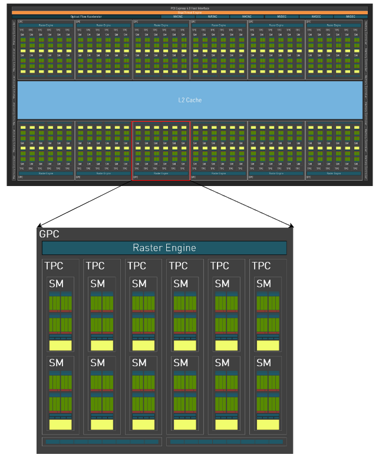
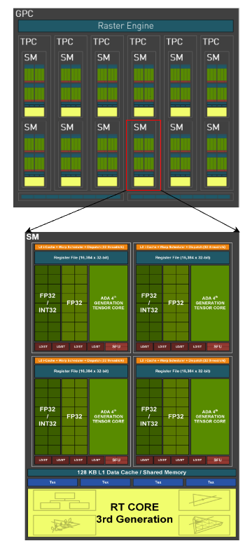

## 架构

不同公司设计生产的 GPU 会有不同的架构差异，同一个公司不同时间生产的 GPU 也可能存在架构上的差异。以 NVIDIA GPU 为例，1999 年 NVIDIA 发布第一代 GPU 架构 GeForce 256，标志着 GPU 时代的开始。随后推出 Tesla、Fermi、Kepler、Maxwell、Pascal、Volta、Turing、Ampere 等 GPU 架构，不断增强 GPU 的计算能力和程序性，推动 GPU 在图形渲染、人工智能和高性能计算等领域的应用

- Tesla（特斯拉）

2006 年 11 月发布，是 NVIDIA 首个通用 GPU 计算架构，它统一了顶点和像素处理器并对其进行了扩展，支持使用计算统一设备架构 (CUDA) 并行编程模型以 C 语言编写的高性能并行计算应用程序和开发工具。Tesla 架构具有 128 个流处理器，带宽高达 86GB/s，标志着 GPU 开始从专用他图形处理器转变成通用数据并行处理器。使用该架构的 GPU 有 GeForce 8800 等

- Fermi（费米）

技术白皮书：<https://www.nvidia.com/content/PDF/fermi_white_papers/NVIDIA_Fermi_Compute_Architecture_Whitepaper.pdf>

2010 年 7 月发布，是第一款采用 40nm 制程的 GPU。Fermi 架构带来了重大改进，包括引入 L1/L2 快速缓存、错误修复功能和 GPU Direct 技术等。Fermi GTX 480 拥有 480 个流处理器，带宽达到 177.4GB/s，比 Tesla 架构提高了一倍以上，代表了 GPU 计算能力的提升。使用该架构的 GPU 有 Geforce 400 系列等

- Kepler（开普勒）

2012 年 3 月发布，英伟达发布 Kepler 架构，采用 28nm 制程，是首个支持超级计算和双精度计算的 GPU 架构。Kepler GK110 具有 2880 个流处理器和高达 288GB/s 的带宽，计算能力比 Fermi 架构提高 3-4 倍。Kepler 架构的出现使 GPU 开始成为高性能计算的关注点。使用该架构的 GPU 有 K80 等

- Maxwell（麦克斯韦）

2014 年 2 月发布，Maxwell 针对流式多处理器 (SM) 采用一种全新设计，可大幅提高每瓦特性能和每单位面积的性能。虽然 Kepler SMX 设计在这一代产品中已经相当高效，但是随着它的发展，NVIDIA 的 GPU 架构师看到了架构效率再一次重大飞跃的机遇，而 Maxwell SM 设计实现了这一愿景。使用该架构的 GPU 有 M10、M40 等

- Pascal（帕斯卡）

2016 年 5 月发布，用于接替上一代的 Maxwell 架构。基于 Pascal 架构的 GPU 将会使用 16nm FinFET 工艺、HBM2、NVLink 2.0 等新技术。使用该架构的 GPU 有 GTX1050、1050Ti、1060、GP100、P6000、P5000、P100、P4、P40 等

- Volta（伏特）

技术白皮书：<https://images.nvidia.cn/content/volta-architecture/pdf/volta-architecture-whitepaper.pdf>

2017 年 5 月发布，Volta 架构增加了 Tensor Core 和相应的性能指标，芯片巨大的面积 815mm 和先进工艺 12nm FFN。使用该架构的 GPU 有 V100 等

- Turing（图灵）

技术白皮书：<https://images.nvidia.cn/aem-dam/en-zz/Solutions/design-visualization/technologies/turing-architecture/NVIDIA-Turing-Architecture-Whitepaper.pdf>

2018 年 8 月发布，在该月的 SIGGRAPH 大会上，NVIDIA 创始人兼首席执行官黄仁勋上发布了 Turing 架构，Turing 架构引入了实时光线追踪（RTX）和深度学习超采样（DLSS）等重要功能。使用该架构的 GPU 有 RTX 2080 Ti、Quadro RTX 6000 等

- Ampere（安培）

技术白皮书：<https://images.nvidia.cn/aem-dam/en-zz/Solutions/data-center/nvidia-ampere-architecture-whitepaper.pdf>

2020 年 5 与发布，在该月的 GTC 大会上，NVIDIA Ampere 架构横空出世，该架构作为一次设计突破，在 8 代 GPU 架构中提供了 NVIDIA 公司迄今为止最大的性能飞跃，统一了 AI 培训和推理，并将性能提高了 20 倍。使用该架构的 GPU 有面向专业图形视觉可视化领域的 RTX A6000、RTX A5000、RTX A4000、RTX A2000，面向高性能计算、人工智能和深度学习领域的 NVIDIA A100、NVIDIA A40、NVIDIA A30、NVIDIA A10，以及面向消费级娱乐领域的 GeForce RTX GPU 等

- Hopper（哈珀）

2022 年 3 月发布，在该月的 GTC 大会上，NVIDIA 宣布推出采用 NVIDIA Hopper 架构的新一代加速计算平台，这一全新架构以美国计算机领域的先驱科学家 Grace Hopper 的名字命名，将取代两年前推出的 NVIDIA Ampere 架构，使用该架构的 GPU 有 H100 等

- Ada Lovelace（阿达 洛芙莱斯）

技术白皮书：<https://images.nvidia.cn/aem-dam/Solutions/geforce/ada/nvidia-ada-gpu-architecture.pdf>

2022 年 9 月发布，NVIDIA 官网宣称 Ada Lovelace GPU 架构能够为光线追踪和基于 AI 的神经图形提供革命性的性能，该架构显著提高了 GPU 性能基准，更代表着光线追踪和神经图形的转折点，使用该架构的 GPU 有 RTX6000、RTX4060Ti 等

- Blackwell

Blackwell 架构以美国统计学和数学先驱David Harold Blackwell 博士的名字命名，他撰写了第一本贝叶斯统计学教科书，Blackwell 架构再次成为 NVIDIA 在公司许多标志性架构设计上加倍努力的理念，希望找到更智能、更努力地工作的方法，以提高其最重要的数据中心/HPC 加速器的性能

## 实例

TX4060Ti 基于 Ada Lovelace 架构（AD102）

### D102

一块 AD102 GPU 包含：

- 1 个 PCIe 4.0 host 接口，用于与 CPU 通信
- 1 个 GigaThread Engine 现成调度引擎，负责将线程块 Block 分配给 SM
- 1 个 Optical Flow Accelerator 光流加速器，光流加速器在原本 DLSS 2 的基础上，还可以计算两个连续帧内的光流场，能够捕捉游戏画面从第 1 帧到第 2 帧的方向和速度，从中捕捉粒子、反射和光照等像素信息。并分别计算运动矢量和光流来获得精准的阴影重建效果。
- 3 个 NVENC 视频编码器和 3 个 NVDEC 视频解码器
- 12 个内存控制器，负责访问显存
- 12 个 GPC
- 1 个共享 L2 cache
- ...

### GPC

图形处理集群（Graphics Processing Clusters）GPC 属于 GPU 的次级单位，一个 GPU 包含多个 GPC，GPU 的架构和代号不同，GPC 的数量也不同，如果把 GPC 展开，就会得到如下结构图，一个 GPC 包含：

- 1 个栅格引擎（Raster Engine），主要功能是边缘侦测、消隐与坐标压缩
- 6 个纹理处理集群（Texture Processing Clusters）TPC，其中每个 TPC 包含 2 个流式多处理器（Streaming Multiprocessors）SM
- ...

### SM

流式多处理器（Streaming Multiprocessors）SM 是英伟达 GPU 中的一种计算核心，用于执行图形和计算任务。一般一个 GPC 包含多个 SM，每个 SM 氛围 4 个子块，每个子块包含：

- L0 i-cache
- warp scheduler，自动分配任务到可用资源，以确保系统负载均衡和资源利用率的最大化
- dispatch 用来分配核心
- Register file 寄存器组
- 16 个可以执行 INT32 或 FP32 的 cuda core，16 个只能执行 FP32 的 cuda core
- 1 个 tensor core
- 1 个 SFu 和 4 个 LS/ST
- ...

SM 除了子块资源，还有：

- 1 个 128KB 的 L1 data chache/shared memory，由 4 个子块共享
- 4 个 Tex
- 一个 RT core 3rd generation
- ...

### GPU 核心

GPU 一般包含三种核心：cuda core、tensor core、RT core，这三种核心各自具有不同的特性和功能：

- cuda core： cuda core 是用于通用并行计算任务的计算核心，早期架构叫 SP（Streaming Processor），fermi 架构开始叫做 cuda core。可以执行单精度和双精度浮点运算，以及整数运算，它在处理广泛的并行计算任务方面非常高效
- tensor core： tensor core 张量核心是针对深度学习和 AI 工作负载而设计的专用核心，可以实现混合精度计算并加速矩阵运算，尤其擅长处理半精度（FP16）和全精度（FP32）的矩阵乘法和累加操作。tensor core 在加速深度学习训练和推理中发挥着重要作用
- RT core：：RT core 是专门用于光线追踪处理的核心，能够高速进行光线和声音的渲染，对于图形渲染和光线追踪等任务具有重要意义

