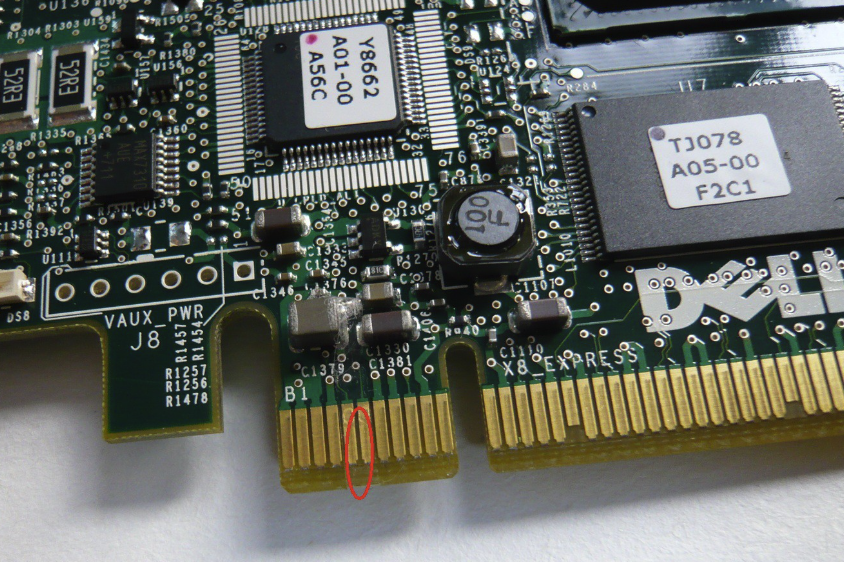

## DELL PERC 系列阵列卡

PERC 是 PowerEdge Raid Controller 的缩写，前缀 S 表示为 Software 软件阵列，H 表示为 Hardware 硬件阵列，从入门到高端型号第一位数字分别用 1 3 7 8 表示，第二三位数字位为产品代数，30 表示为 13G 代产品，结尾 P 表示 Performance 高性能型

常见型号如下

- PERC S120 入门软件阵列卡，主板集成无缓存 支持 RAID0 1；
- PERC H330 入门硬件 RAID 卡，无板载缓存，支持 RAID 0 1 5 10 50；
- PERC H730 主流硬件 RAID 卡带有 1G 缓存和电池 支持 RAID 0 1 5 6 10 50 60；
- PERC H730P 高性能硬件 RAID 卡带有 2G 缓存和电池 支持 RAID 0 1 5 6 10 50 60；
- PERC H830 同 H730P, 没有内置接口，使用外置接口连接附加存储磁盘柜用
- H330/730/730P 阵列卡均有 2 种规格，标准 PCI-E 8X 插卡和直接安装固定主板上的 mini 小卡，通常可以选择小卡即可

## 安装在普通主板上

需要关闭 DirectpdMapping 选项

屏蔽 5 、6 针脚

smbus 兼容性问题

