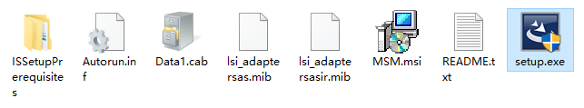
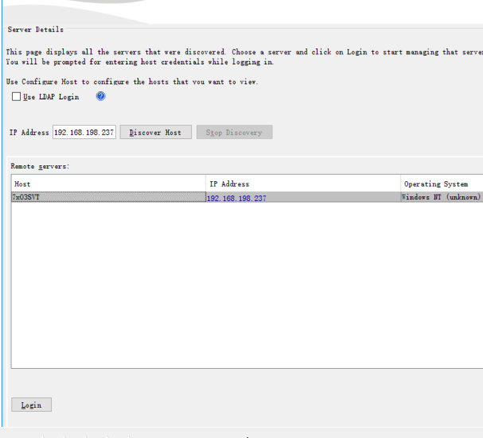
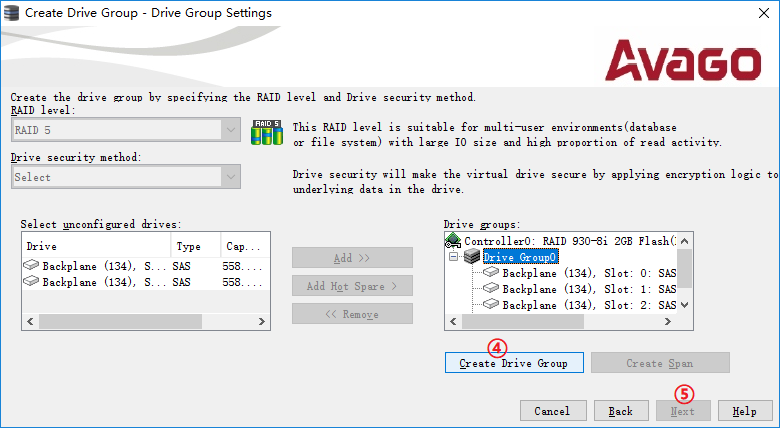
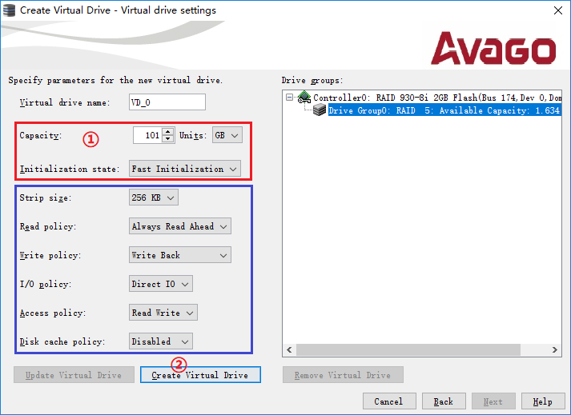
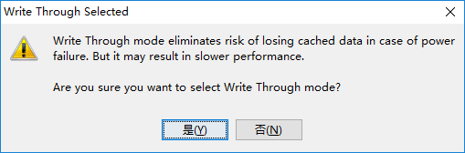

## MegaRAID Storage Manager RAID 管理工具

MegaRAID Storage Manager（以下简称为 "MSM"）是用于管理采用 LSI (Avago/Broadcom) RAID 架构阵列的图形化管理工具

MSM 是一个用于服务器本机存储管理的软件，适用于现在属于 Broadcom（博通）公司产品线的磁盘阵列卡，是主流品牌服务器的标配。MSM 新版本 17.05.06，测试后发现对于较新的阵列卡可以提供更多的管控操作功能。

注意：17.05.06新版本不再打包附带JRE，MSM 17.05.06需要使用Java 8

## 安装 MSM

本文仅以在服务器本地操作系统中运行为例。

下载和解压缩 Windows 版 MSM 安装包，运行 "Setup.exe"。

运行后首先要求安装必要的运行库，如 VC++ 组件，点击 "Install" 按钮继续。

接下来进入 MSM 安装向导，点击 "Next" 按钮继续。

许可协议，点击 "I accept..." 单选框，再点击 "Next" 按钮继续。

用户信息，可以选择 "All users" 为所有用户安装或者 "Only for current user" 只为当前用户安装，点击 "Next" 按钮继续。

安装位置，选择要安装到的文件夹位置，一般默认即可，点击 "Next" 按钮继续。

安装类型，选择 "Complete" 完整安装或者 "Custom Installation" 自定义安装，默认完整安装，点击 "Next" 按钮继续。

设置 LDAP 登陆，如果仅在本机上使用也没有 LDAP 服务器的话，选择 "No"， 点击 "Next" 按钮继续。

密钥长度设置，仅在本机上使用则保持默认，点击 "Next" 按钮继续。

设置收集过往日志的范围，可选 "Since Last Shutdown" 从上次关机、"Since Log Clear" 从上次日志清除、"Since Last Reboot" 从上次重启，一般保持默认即可，点击 "Next" 按钮继续。

准备开始安装，点击 "Next" 按钮继续。

安装完成，点击 "Finish" 按钮关闭向导。

## 登陆 MSM 及 MSM 主界面介绍

安装 MSM 后，会在桌面及开始菜单中生成快捷方式。

运行后会识别出本机的主机名称及IP地址，双击或者点击下方 "Login" 按钮登陆。

注意：刚完成 MSM 安装或者重启后，可能需要等待数分钟，待后台服务启动才发现本机。

输入操作系统的本地用户名及密码登录，不能使用域账户。

"Login Mode" 登陆模式保持默认的 "Full Access" 全权访问。

然后就进入了 MSM 的主界面。

MSM 界面分为上、中、下三部分：

上部是菜单栏及工具按钮，按钮从左到右分别是：选择主机、刷新、调整、新建阵列、登出、帮助；

中部是交互窗口，包括 "Dashboard" 仪表板、"Physical" 物理视图及 "Logical" 逻辑视图三个标签页；

下部是日志窗口，会按日志类别ID、关键级别、时间日期及内容表述的方式排列日志。

在 Physical 标签页中，会显示所有物理硬件及其状态属性，包括阵列卡、背板(Expander)、硬盘、电池（超级电容）等。

在Logical标签页中，会显示所有逻辑配置及其状态属性，包括阵列(Drive Group)及卷(Virtual Drive)等。

## 创建 RAID 阵列

为便于操作，以下均隐藏了日志窗口和状态属性窗口。

在 Physical 标签页或者 Logical 标签页中，确认有足量且状态为 "Unconfigured Good" 的硬盘。

右键点击阵列卡型号，再点击 "Create Virtual Drive"

如果存在 JBOD 状态的硬盘，会先提示是否将 JBOD 状态的硬盘转换为 Unconfigured Good 状态。

如要转换，则选中相应的硬盘，并点击 "Convent" 按钮；如不转换，则勾选 "Do not convent JBOD..."，再点击 "Next" 下一步。

在创建阵列向导中，选择 "Advanced" 高级模式单选框，再点击 "Next" 下一步。

"Simple" 简单模式本文不介绍。

以创建由 4 个硬盘组成的 RAID5 阵列为例。"RAID Level" 选择 "RAID 5"，在 "Select unconfigured drives:" 中选中硬盘（可按 Shift 键或者 Ctrl 键同时选中多个硬盘），再点击 "Add >>" 按钮添加到 "Drive groups:" 中。

在 "Drive groups:" 中确认硬盘无误后，点击 "Create Drive Group" 创建阵列，再点击 "Next" 下一步。

接下来设置 RAID5 卷的属性，可以自定义 "Capacity" 卷容量、"Initialization State" 初始化等选项。

- "Capacity" 卷容量：默认是最大值，可根据需求调整数值和 "Units" 单位。

- "Initialization state" 初始化：默认是 "No Initialization" 不初始化，不会抹除硬盘上的数据；如果是要在创建阵列同时抹除硬盘上原有的数据的话，建议选择 "Fast Initialization" 快速初始化，"Full Initialization" 完全初始化可能需要数小时的时间才能完成。

- "Strip size" 条带尺寸：RAID 阵列的最小数据块尺寸，如非专业人员及有特定需求，否则不建议修改默认值。

- "Read policy" 读缓存策略，如非专业人员及有特定需求，否则不建议修改默认值。

- "Write policy" 写缓存策略，如非专业人员及有特定需求，否则不建议修改默认值。

- "I/O policy"IO 策略：默认为 "Direct I/O"，如非专业人员及有特定需求，否则不建议修改默认值。

- "Access policy" 访问策略：默认为 "Read Write"，如非专业人员及有特定需求，否则不建议修改默认值。

- "Disk cache policy" 硬盘缓存策略，如非专业人员及有特定需求，否则不建议修改默认值。

设置完毕后，点击 "Create Virtual Drive"。

根据 "Write policy" 选项设置的不同，会有相应的警告提示，确认后继续。

Write Back 回写模式：提供最佳的阵列读写性能，但仅当阵列卡配备有电池、超级电容时才生效。如果没有电池、超级电容，或者未处于正常状态，则自动切换为 Write Through 直写模式。

Write Through 直写模式：当遇到停电事故时缓存数据丢失风险最低，但阵列读写性能也较低。

Always Write Back 强制回写模式：不论是否配备有电池、超级电容，以及其状态是否正常，都强制使用回写模式。此时能提供最佳的读写性能，但数据丢失风险最高。

## 参考资料

- <https://iknow.lenovo.com.cn/detail/178452#01>
- <https://www.orcy.net.cn/3824.html>
- <https://mirrors.orcy.net.cn:10101/MegaRAID_SAS_9260-4i_%209260-8i_%209260DE-8i_%209261-8i/>