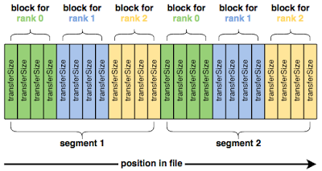

## IOR 简介

IOR 设计用于测量 POSIX 和 MPI-IO 级别的并行文件系统的 I/O 的性能

IOR 使用 MPI 进行进程同步（也可以使用 srun 或其他工具） - 通常在 HPC（High Performance Computing）集群中的多个节点上并行运行 IOR 进程，在安装目标文件系统的每个客户机节点上运行一个 IOR 进程。

IOR测试通常涉及以下关键方面：

1. 并行文件I/O： IOR允许在多个计算节点上同时执行文件I/O操作，以模拟并行应用程序在HPC环境中的文件读取和写入操作。这有助于评估系统的并行I/O性能
2. 吞吐量和延迟： IOR测试会测量系统在不同并行工作负载下的数据吞吐量和延迟。这有助于了解系统在处理大规模数据时的性能表现
3. 文件大小和访问模式： IOR测试允许用户指定要测试的文件大小、读取和写入的访问模式（例如随机访问或顺序访问），以模拟不同类型的应用程序工作负载
4. 并行文件系统支持： IOR通常用于测试并行文件系统的性能，这是在HPC集群中常见的存储解决方案。测试可以帮助评估这些文件系统在高并发环境中的表现
5. 性能度量： IOR测试会生成各种性能度量，包括带宽、IOPS（每秒的I/O操作数）、延迟和效率等，以帮助用户评估存储系统的性能特征

官方：

- GitHub 仓库：<https://github.com/hpc/ior>
- 文档：<https://ior.readthedocs.io/en/latest/>

## 构建

安装依赖程序

```bash
dnf install -y gcc gcc-c++ gcc-gfortran
```

安装 openmpi，最新版本可查询：<https://www.open-mpi.org/software/> 或者 <https://github.com/open-mpi/ompi>，Rocky9 源中已自带

```bash
dnf install -y openmpi openmpi-devel
```

修改 `/etc/profile` 或者 `${USER}/.bash_profile`，追加如下内容：

```bash
if [ -z "$OPENMPI_ADDED" ]; then
    export PATH=/usr/lib64/openmpi/bin${PATH:+:${PATH}}
    export OPENMPI_ADDED=yes
    export LD_LIBRARY_PATH=/usr/lib64/openmpi/lib${LD_LIBRARY_PATH:+:${LD_LIBRARY_PATH}}
    export MPI_CC=mpicc
fi

```

下载 ior 源码后进行编译安装：

```bash
./configure

make 

make install
```

## IOR 入门

IOR使用以下参数顺序写入数据：

- blockSize (-b)
- transferSize (-t)
- segmentCount (-s)
- numTasks (-n)



```bash
ior -t 1m -b 16m -s 16
```

使用(-FfilePerProcess=1 ) 选项 从写入单个共享文件切换为每个进程一个文件，这会显着改变性能：

```bash
mpirun -np 40 ior -t 1m -b 16m -s 16 -F
```

### 页面缓存对基准测试的影响

真正发生的情况是，IOR 读取的数据实际上并不是来自并行文件系统，相反，文件的内容已经被缓存到计算节点的运行内存中，并且 IOR 能够直接从每个计算节点的 DRAM 中读取它们，因此 IOR 不是直接向并行文件系统写入和读取数据，实际上主要是每个计算节点上的内存。

有多种方法可以测量底层 Lustre 文件系统的读取性能。最粗略的方法是简单地写入比总页缓存容纳的数据更多的数据，以便在写入阶段完成时，文件的开头已经从缓存中逐出。例如，增加段数（-s）以写入更多数据。

更好的选择是让每个节点上的 MPI 进程只读取它们未写入的数据。例如，在每节点 4 个进程的测试中，将 MPI 进程到块的映射移动 4 个，使每个节点 N 读取节点 N-1 写入的数据。

由于页面缓存不在计算节点之间共享，因此以这种方式转移任务可确保每个 MPI 进程正在读取它未写入的数据。 IOR 提供了-C选项（reorderTasks）来执行此操作，它强制每个 MPI 进程读取其相邻节点写入的数据。使用此选项运行 IOR 可提供更可靠的读取性能：

```bash
mpirun -np 160 ior -t 1m -b 16m -s 16 -F -C
```

由于页面缓存，当写入已提交到内存而不是底层文件系统时，页面缓存会向 IOR 发出写入完成的信号

为了解决页面缓存对写入性能的影响，我们可以在所有write()返回后立即发出fsync()调用，以强制刚刚写入的dirt page刷新到 Lustre。包括fsync()完成所需的时间可以衡量数据写入页面缓存以及页面缓存写回 Lustre 所需的时间

IOR 提供了另一个方便的选项-e ( fsync ) 来执行此操作。并且，再次使用此选项会改变性能测量：

```bash
mpirun -np 160 ior -t 1m -b 16m -s 16 -F -C -e
```

这样就对文件系统有了可信的带宽测量

## 参考文档

- <https://doc.beegfs.io/latest/advanced_topics/benchmark.html?highlight=chunk>
- <https://docs.hpc.sjtu.edu.cn/app/benchtools/io500.html>

- <https://docs.hpc.sjtu.edu.cn/app/benchtools/ior.html>
