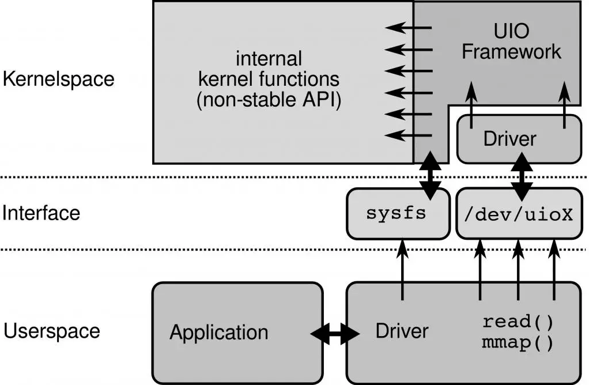

## Linux + x86 网络 IO 瓶颈

问题：

1. 传统的收发报文方式都必须采用硬中断来做通讯，每次硬中断大约消耗 100 微秒，这还不算因为终止上下文所带来的 Cache Miss
2. 数据必须从内核态用户态之间切换拷贝带来大量 CPU 消耗，全局锁竞争
3. 收发包都有系统调用的开销
4. 内核工作在多核上，为可全局一致，即使采用 Lock Free，也避免不了锁总线、内存屏障带来的性能损耗
5. 从网卡到业务进程，经过的路径太长，有些其实未必要的，例如 netfilter 框架，这些都带来一定的消耗，而且容易 Cache Miss

## DPDK 简介

### DPDK 的基本原理

IO 实现的方式、内核的瓶颈，以及数据流过内核存在不可控因素，这些都是在内核中实现，内核是导致瓶颈的原因所在，要解决问题需要绕过内核。所以主流解决方案都是旁路网卡 IO，绕过内核直接在用户态收发包来解决内核的瓶颈。

Linux 社区也提供了旁路机制 Netmap，官方数据 10G 网卡 1400 万 PPS，但是 Netmap 没广泛使用。其原因有几个：

1. Netmap 需要驱动的支持，即需要网卡厂商认可这个方案
2. Netmap 仍然依赖中断通知机制，没完全解决瓶颈
3. Netmap 更像是几个系统调用，实现用户态直接收发包，功能太过原始，没形成依赖的网络开发框架，社区不完善

DPDK 旁路原理：

左边是原来的方式数据从 `网卡 -> 驱动 -> 协议栈 -> Socket接口 -> 业务`

右边是 DPDK 的方式，基于 UIO（Userspace I/O）旁路数据。数据从 `网卡 -> DPDK 轮询模式-> DPDK 基础库 -> 业务`

用户态的好处是易用开发和维护，灵活性好。并且 Crash 也不影响内核运行，鲁棒性强。

### 支持列表

DPDK 支持的 CPU 体系架构：<https://core.dpdk.org/supported/cpus/>

- x86
- ARM
- PowerPC（PPC）

DPDK 支持的网卡列表：<https://core.dpdk.org/supported/nics/>

### UIO

为了让驱动运行在用户态，Linux 提供 UIO 机制。使用 UIO 可以通过 read 感知中断，通过 mmap 实现和网卡的通讯。

UIO 原理：

要开发用户态驱动有几个步骤：

1. 开发运行在内核的 UIO 模块，因为硬中断只能在内核处理
2. 通过 `/dev/uioX` 读取中断
3. 通过 mmap 和外设共享内存

### PMD

DPDK 的 UIO 驱动屏蔽了硬件发出中断，然后在用户态采用主动轮询的方式，这种模式被称为 PMD（Poll Mode Driver）。

UIO 旁路了内核，主动轮询去掉硬中断，DPDK 从而可以在用户态做收发包处理。带来 Zero Copy、无系统调用的好处，同步处理减少上下文切换带来的 Cache Miss。

运行在 PMD 的 Core 会处于用户态 CPU100% 的状态 

网络空闲时 CPU 长期空转，会带来能耗问题。所以，DPDK 推出 Interrupt DPDK 模式。

Interrupt DPDK： 

它的原理和 NAPI 很像，就是没包可处理时进入睡眠，改为中断通知。并且可以和其他进程共享同个 CPU Core，但是 DPDK 进程会有更高调度优先级。

## DPDK 生态

对互联网后台开发来说 DPDK 框架本身提供的能力还是比较裸的，比如要使用 DPDK 就必须实现 ARP、IP 层这些基础功能，有一定上手难度。如果要更高层的业务使用，还需要用户态的传输协议支持。不建议直接使用 DPDK。

目前生态完善，社区强大（一线大厂支持）的应用层开发项目是 `FD.io（The Fast Data Project`），有思科开源支持的 VPP，比较完善的协议支持，ARP、VLAN、Multipath、IPv4/v6、MPLS 等。用户态传输协议 UDP/TCP 有 TLDK。从项目定位到社区支持力度算比较靠谱的框架。

- F-Stack <https://github.com/F-Stack/f-stack>

腾讯云开源的 F-Stack 也值得关注一下，开发更简单，直接提供了 POSIX 接口。

- Seastar <https://github.com/scylladb/seastar>

Seastar 也很强大和灵活，内核态和 DPDK 都随意切换，也有自己的传输协议 Seastar Native TCP/IP Stack 支持，但是目前还未看到有大型项目在使用 Seastar，可能需要填的坑比较多。

## 参考资料

- <https://blog.csdn.net/qq_20817327/category_10796562.html>
